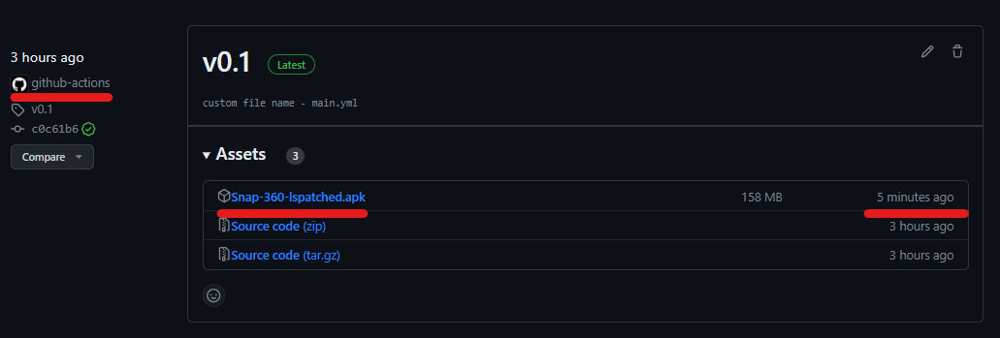
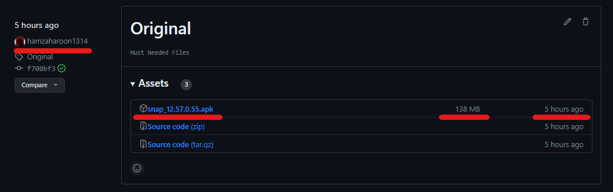

# SnapEnhanceModGen

This repository contains a GitHub Actions workflow for generating a Snapchat APK by using the [SnapEnhance Module](https://github.com/rhunk/SnapEnhance) and creating a public release.

## How to get MOD APK link
1. Install the latest [Snapchat MOD apk](https://github.com/hamzaharoon1314/SnapEnhanceModGen/releases)
2. Install the latest [SnapEnhance apk](https://github.com/rhunk/SnapEnhance/releases/latest) (If you don't know what version (armv8 or armv7) to download check out [this app](https://play.google.com/store/apps/details?id=com.abs.cpu_z_advance&hl=de&gl=US) and go into the CPU tab it will show you which version your phone supports)
3. Done - ~have fun
   

## Instructions for own Setup

1. **Fork this Repository**: Click the "Fork" button to create your copy of this repository.

2. **Set up Secrets**: In your forked repository, go to "Settings" > "Secrets" and add the following secrets:

   - `SNAP_ENHANCE_APK_URL`: The URL for the SnapEnhance APK. https://github.com/rhunk/SnapEnhance/releases/download/PASTE-NEWEST-VERSION/app-PASTE-NEWEST-VERSION-armv8-release-signed.apk (Check what the newest version is [here](https://github.com/rhunk/SnapEnhance/releases/latest)).
   - `SNAP_APK_URL`: The URL for the Snap APK. Download the latest or your preffered Snap APK from [APKMirror](https://www.apkmirror.com/apk/snap-inc/snapchat/) and upload it as a github Release and use the download link of the apk in that release as the Secret URL.
       

3. **Trigger the Workflow**: Any push (Changing/Adding/Deleting a file in your repo) to your repository will trigger the GitHub Actions workflow. The workflow will download the required files, run the `java -jar lspatch.jar` command, and create a public release with the modified APK.

4. **Download the Release**: After the workflow completes, you can find the modified APK under the "Releases" tab.
 
## Customization

- You can customize the release tag and name by editing the `.github/workflows/main.yml` file.
- Modify the `tag_name` and `release_name` values in the "Create Release" step.

## Contributing

You can feel free to contribute to this project by opening issues and pull requests.

